# 响应式

+ 网页的宽度自动调整
+ 尽量少用绝对宽度，可以用百分比
+ 字体要使用 rem / em 作为单位
  + rem 就是根结点字体大小是一个相对单位
  + 所以要根据用户屏幕的尺寸动态的设置 html 根结点的字体大小


# [@media](https://developer.mozilla.org/en-US/docs/Web/CSS/@media)

## 媒体类型

+ all 所有设备
+ print 打印机设备
  ```css
  @media print {
    div {
      font-size: 80px;
    }
  }
  ```
  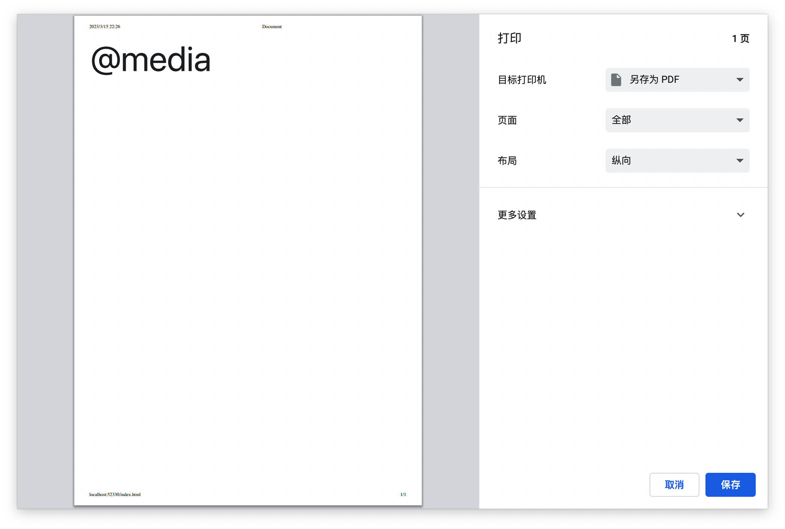
+ screen 彩色的电脑屏幕
  如果不指定的话，浏览器端默认是screen
  ```css
  @media screen {
    div {
      background-color: lightblue;
    }
  }
  ```
+ speech 听觉设备(针对有视力障碍人士，可以把页面的内容以语音方式呈现的设备)

> tty、tv、projection、handheld、braille、embossed、aural 等几种类型在媒体查询4中已经废弃

## 媒体特性
媒体特性要放到括号里面
+ width
  + min-width
    ```css
    /* 屏幕尺寸大于500的时候满足 */
    @media (min-width: 500px) {
      div {
        background-color: lightblue;
      }
    }
    ```
  + max-width
    ```css
    /* 屏幕尺寸小于400的时候满足 */
    @media (max-width: 500px) {
      div {
        background-color: lightblue;
      }
    }
    ```

+ height
  + min-height
  + max-height

+ orientation 方向
  + landscape 横屏，宽度大于高度
    ```css
    /* 横屏的时候满足 */
    @media (orientation: landscape) {
      div {
        background-color: lightblue;
      }
    }
    ```
    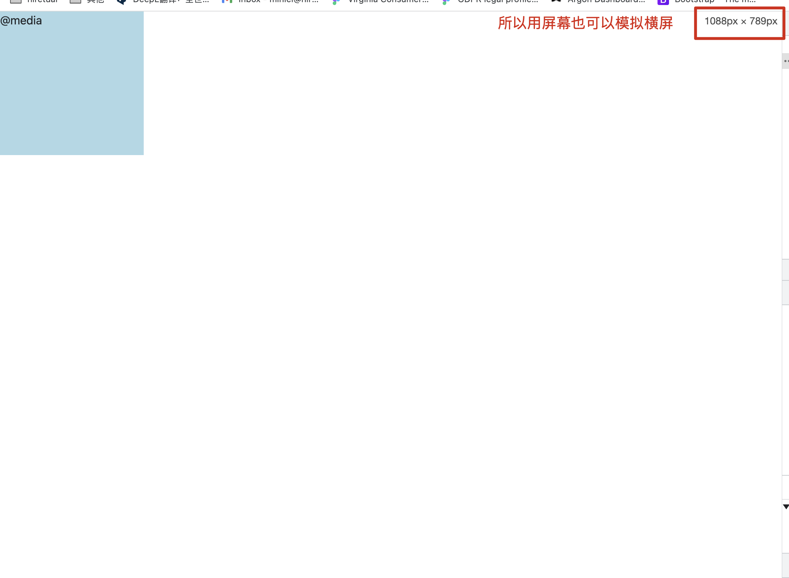
  + portrai 竖屏，高度大于宽度 竖屏和上面同一个原理

+ aspect-ratio 宽度比
  ```css
  /* 宽高比为 4:3 的时候满足 */
  @media (aspect-ratio: 4/3) {
    div {
      border: 10px solid lightseagreen;
    }
  }
  ```
  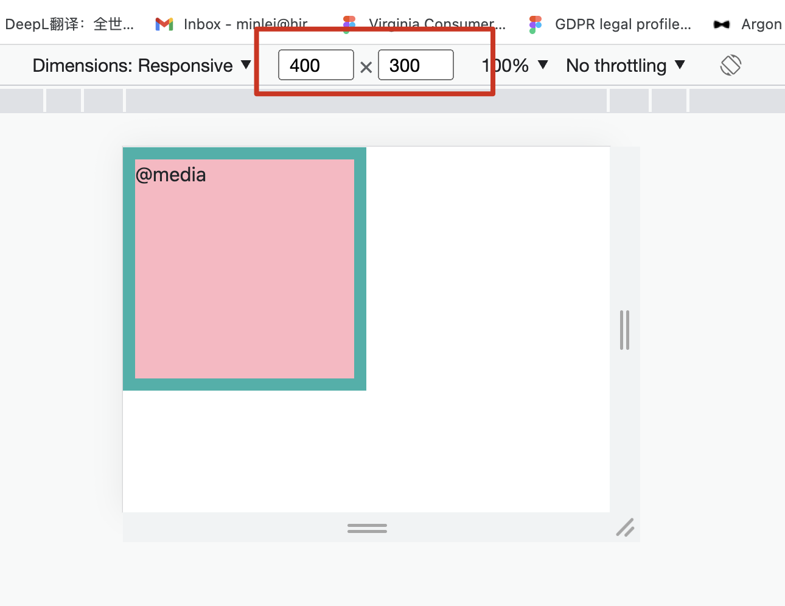
+ -webkit-device-pixel-ratio 像素比，webkit 内核的私有属性
  ```css
  /* 当像素比为2的时候满足 */
  @media (-webkit-device-pixel-ratio: 2) {
    div {
      border: 10px solid lightseagreen;
    }
  }
  ```

## 逻辑运算符
用来做条件判断
+ and 合并多个媒体查询, 多个条件同时满足
  ```css
  /* 屏幕的尺寸大于700px 并且是横屏 */
  @media all and (min-width: 700px) and (orientation: landscape) {
    div {
      background-color: lightcyan;
    }
  }
  ```
+ , 英文逗号，匹配某个媒体查询，或者
  ```css
  /* 屏幕小于500 或者 是横屏 */
  @media (max-width: 500px), (orientation: landscape) {
    div {
      background-color: lightcyan;
    }
  }
  ```
+ not 对媒体查询结果取反
  ```css
  /* 屏幕尺寸大于800的时候满足，不是很会用 */
  @media not all and (max-width: 800px) {
    div {
      background-color: black;
    }
  }
  ```
+ only 仅在媒体查询匹配成功后应用样式（防范老旧浏览器）
  
  旧的浏览器不支持`@media`，当检测到`@media`中对元素设置样式时，无论条件是否匹配都会直接应用。所以用only避免这种情况


# Grid

+ container-fluid: 默认width：100%

+ container: 根据不同的屏幕尺寸有不同的值

+ row

+ col-xl-1
  + 后面的数字代表当前div占几列
    + `<div class="col-xl-1">1</div>` 1就是占1列
  + xl 响应层对应的简写
    + Extra small (xs)
    + Small (sm)
    + Medium (md)
    + Large (lg)
    + Extra large (xl)
    + Extra extra large (xxl)
    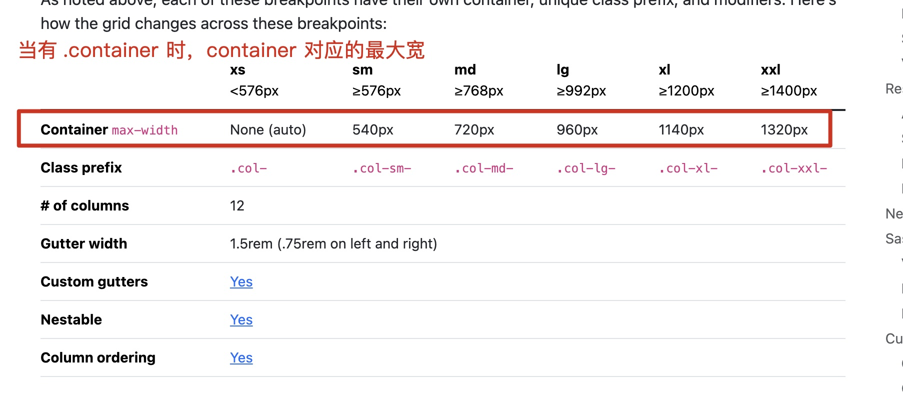

+ col 所占列数是等分算
  ```html
  <div class="container">
    <div class="row">
      <div class="col"></div>
      <div class="col"></div>
      <div class="w-100"></div>
      <div class="col"></div>
      <div class="col"></div>
    </div>
    <div class="row mt-5">
      <div class="col"></div>
      <div class="col"></div>
      <div class="col"></div>
      <div class="col"></div>
      <div class="col"></div>
    </div>
  </div>
  ```
  自己领悟吧！
  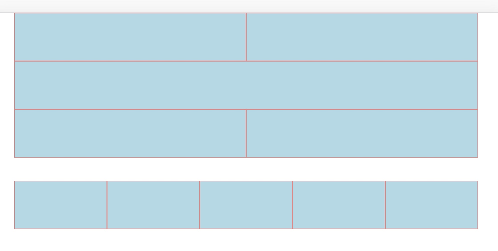

  ```html
  <div class="container">
    <!-- 设置一个固定列宽，剩下的自动平分 -->
    <!-- 并且当 col-sm-7 占一列的时候，下面的两个col会自动换行，平分第二行-->
    <div class="row">
      <div class="col-sm-7">屏幕大于等于576，占7列,小于576全占</div>
      <div class="col">自动平分剩余的宽度</div>
      <div class="col">自动平分剩余的宽度</div>
    </div>
  </div>
  ```
  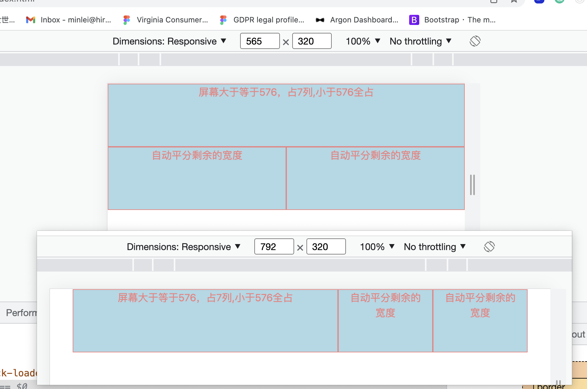

  ```html
  <div class="container">
    <!-- 根据内容调整列的宽度 使用 .col-{breakpoint}-auto-->
    <!-- breakpoint 是指 xs sm md ... -->
    <div class="row">
      <div class="col-md-auto">
        <p>在中等屏幕下(>=768)，由内容撑开宽度</p>
        <p>屏幕小于768的时候，会占满父级div</p>
      </div>
      <div class="col">自动平分剩余宽度</div>
      <div class="col-lg-2">(>=992)时占两列</div>
    </div>
  </div>
  ```
  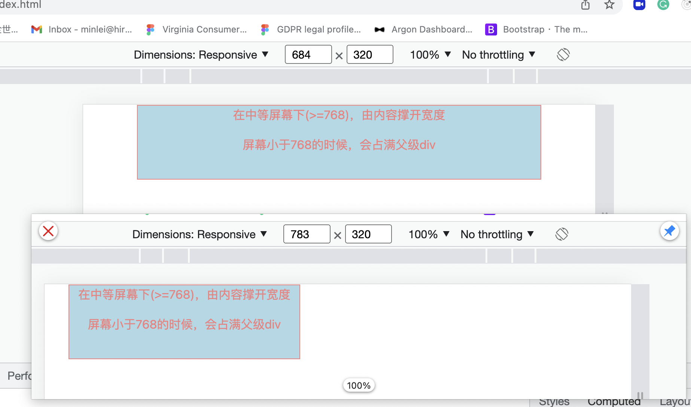
  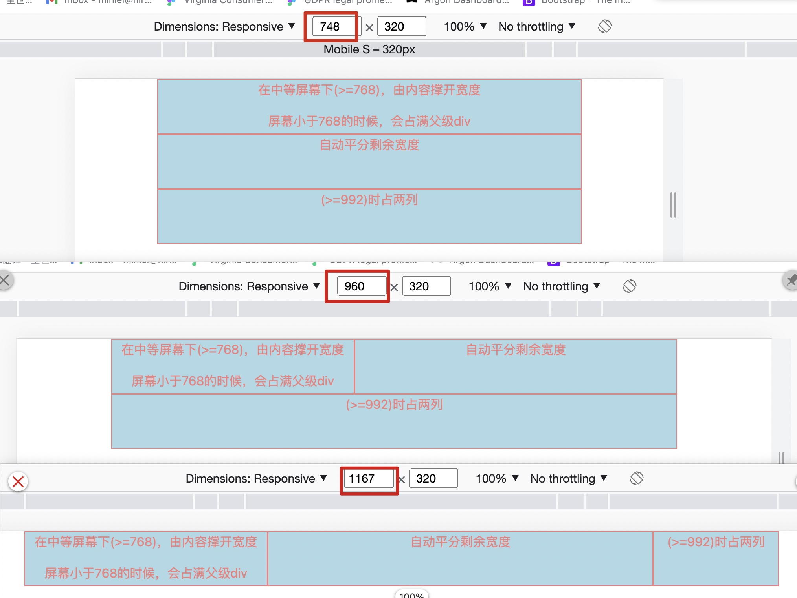

  ```html
  <div class="container">
    <!-- 所以要尺寸下，都是响应的列数 -->
    <div class="row">
      <div class="col-8">所有尺寸下，都占8列</div>
      <div class="col-4">所有尺寸下，都占4列</div>
    </div>
  </div>
  ```

  ```html
  <div class="container">
    <!-- 混合排列 组合模式 -->
    <!-- 1. 超大屏幕(>=1200)下一行显示6个div，一个div应该占2列 -->
    <!-- 2. 大屏幕(>=992)下一行显示4个div，一个div应该占3列 -->
    <!-- 3. 中等屏幕(>=768)下一行显示3个div，一个div应该占4列 -->
    <!-- 4. 小屏幕(>=576)下一行显示2个div，一个div应该占6列 -->
    <!-- 5. 超小屏幕(<576)下一行显示1个div，一个div应该占12列 -->

    <div class="row">
      <div class="col-xl-2 col-lg-3 col-md-4 col-sm-6 col-12"></div>
      <div class="col-xl-2 col-lg-3 col-md-4 col-sm-6 col-12"></div>
      <div class="col-xl-2 col-lg-3 col-md-4 col-sm-6 col-12"></div>
      <div class="col-xl-2 col-lg-3 col-md-4 col-sm-6 col-12"></div>
      <div class="col-xl-2 col-lg-3 col-md-4 col-sm-6 col-12"></div>
      <div class="col-xl-2 col-lg-3 col-md-4 col-sm-6 col-12"></div>
    </div>
  </div>
  ```

+ 垂直对齐
  ```html
  <div class="container">
    <!-- 对齐 -->
    <!-- 垂直对齐 -->
    <!-- 行的对齐方式：align-items-start align-items-center align-items-end -->
    <!-- 列的单独对齐方式：align-self-start align-self-center align-slef-end -->

    <div class="row v-align align-items-start">
      <div class="col">垂直对齐-align-items-start-行的对齐方式</div>
      <div class="col">垂直对齐-align-items-start-行的对齐方式</div>
      <div class="col">垂直对齐-align-items-start-行的对齐方式</div>
    </div>
    <div class="row v-align align-items-center">
      <div class="col">垂直对齐-align-items-center-行的对齐方式</div>
      <div class="col">垂直对齐-align-items-center-行的对齐方式</div>
      <div class="col">垂直对齐-align-items-center-行的对齐方式</div>
    </div>
    <div class="row v-align align-items-end">
      <div class="col">垂直对齐-align-items-end-行的对齐方式</div>
      <div class="col">垂直对齐-align-items-end-行的对齐方式</div>
      <div class="col">垂直对齐-align-items-end-行的对齐方式</div>
    </div>

    <div class="row v-align align-items-end">
      <div class="col align-self-start">
        垂直对齐-align-self-start-列的对齐方式
      </div>
      <div class="col align-self-center">
        垂直对齐-align-self-center-列的对齐方式
      </div>
      <div class="col align-slef-end">
        垂直对齐-align-slef-end-列的对齐方式
      </div>
    </div>
  </div>
  ```
  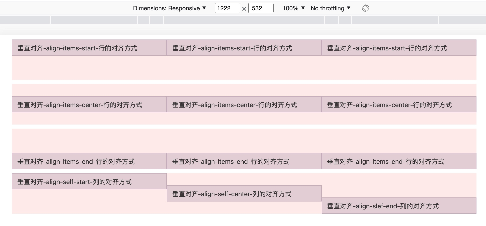

+ 水平对齐
  + 就不演示了
  + justify-content-start
  + justify-content-center
  + justify-content-end
  + justify-content-around
  + justify-content-between

+ order-{breadPoint}-*
  + order-first 排在第一位
  + order-last  排在最后一位
  + 没听懂是怎么根据排的
  + breadPoint 表示 满足对应的尺寸才会进行排序
  
+ offset-{breadPoint}-*
  ```html
  <div class="container">
    <div class="row">
      <div class="col-md-4">第一列</div>
      <div class="col-md-4 offset-md-4">往右偏移4列</div>
    </div>

    <div class="row">
      <div class="col-3 offset-4">往右偏4列</div>
      <div class="col-3">第二列</div>
    </div>
  </div>
  ```
  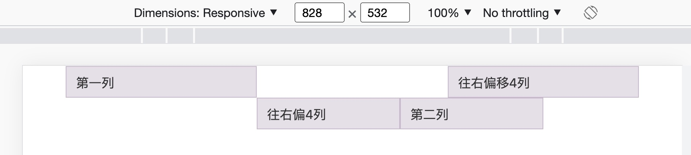

+ spacing
  + ms-{breadPoint}-* 右侧的列远离到最右边，也就是在左边加margin
  + me-{breadPoint}-* 左侧的列远离到最左边，也就是在右侧加margin
  ```html
  <div class="container">
    <div class="row">
      <div class="col-md-4">第一列</div>
      <div class="col-md-5 ms-auto">第二列在最右边</div>
    </div>
    <div class="row mt-5">
      <div class="col-md-4 ms-auto">离左侧距离自动计算</div>
      <div class="col-md-5 ms-auto">离左侧距离自动计算</div>
    </div>
    <div class="row mt-5">
      <div class="col-auto me-auto">宽度由内容撑开，离右边的距离自动计算</div>
      <div class="col-auto">宽度由内容撑开</div>
    </div>
  </div>
  ```
  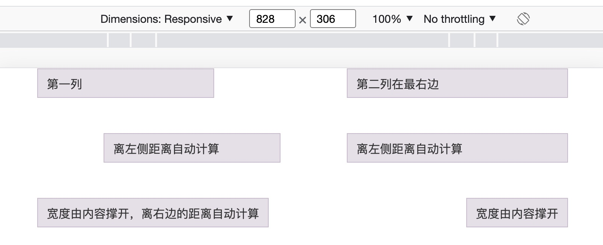

+ 嵌套
  ```html
  <div class="container">
    <!-- 嵌套：每一个列里面可以再继续放元素，嵌套在里面的元素会以父级的宽度为基准，再分12个列 -->
    <div class="row">
      <div class="col-sm-9">
        <p>父级第一列</p>
        <div class="row">
          <div class="col-sm-8 col-6">
            子级第一列，(≥576)下占8列，小于576下占6列
          </div>
          <div class="col-sm-4 col-6">
            子级第二列，(≥576)下占4列，小于576下占6列
          </div>
        </div>
      </div>
      <div class="col-sm-3">
        <p>父级第二列</p>
      </div>
    </div>
  </div>
  ```
  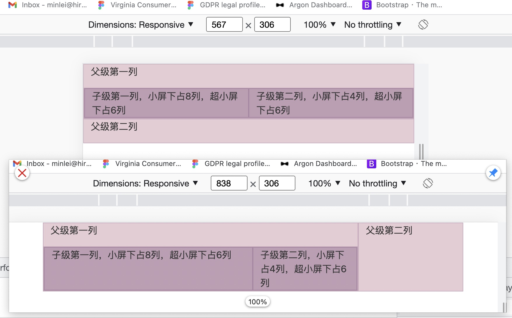

