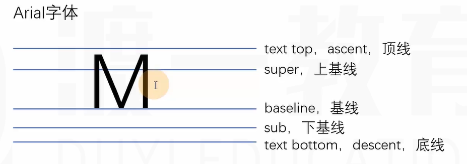
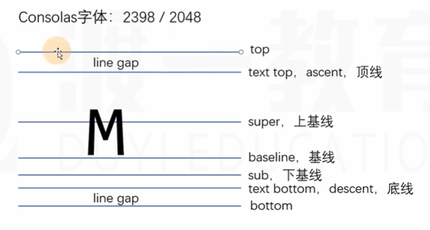
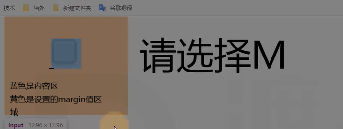

[markdown使用方法](https://www.cnblogs.com/liugang-vip/p/6337580.html)

# @规则
at-rule:@规则，@语句，css语句，css指令。一般就是这四种翻译
不同的@规则有不同的作用
1. @import
>@import "路径";
导入另一个css文件;

 一般引用css文件的方式:
```html
<link rel="stylesheet" href="css/index.css">
<link rel="stylesheet" href="css/reset.css">
```
@import引用css文件的方式，通过在css文件中引入另一个css文件
```html
<link rel="stylesheet" href="css/index.css">
```
```css
/* 在index.css文件中，写到第一行，确保先解析reset.css文件 */
@import "reset.css";
```
2. @charset
>@charset "utf-8";
可以不写这一行，如果css文件中出现中文的话，最好写上
告诉浏览器该css文件使用的字符编码集，
这个指令必须要写到第一行，
```css
@charset "utf-8";
@import "reset.css";
```
### @import 和 link的区别

1. 语法结构不同

   + html标签

     > <link href="CSSurl路径" rel="stylesheet" type="text/css" />

   + @规则

     > @import url('src');

2. link是XHTML标签，除了加载CSS外，还可以定义RSS等其他事务；@import属于CSS范畴，只能加载CSS。

3. link引用CSS时，在页面载入时同时加载；@import需要页面网页完全载入以后加载。

4. link是XHTML标签，无兼容问题；@import是在CSS2.1提出的，低版本的浏览器不支持。

5. link支持使用Javascript控制DOM去改变样式；而@import不支持。


# web字体和图标

重新看一遍吧。
## web字体
解决用户电脑上没有安装相应字体的问题
强制用户下载该字体

## 图标


### iconfont

### Font Awesome


# 块级格式化上下文（和定位一起看，重新看一遍吧）

全称：Block Formatting Context 
简称：BFC
>视觉格式化模型包含了块级格式化上下文
>块级格式化上下文包含了以下这些具体的规则

它是一块**独立的渲染区域**，它规定了在该区域中**常规流块盒**的布局
- 常规流块盒在水平方向上，必须撑满包含块
- 常规流块盒在包含块的垂直方向上依次摆放
- 常规流块盒若外边距无缝相邻，则进行外边距合并
- 常规流块盒的自动高度和摆放位置无视浮动元素

## BFC独立的渲染区域
这个区域由某个HTML元素创建，以下元素会在其内部**创建BFC区域**：

- 根元素：意味着<html>元素创建的BFC区域，覆盖了网页中所有的元素
- 浮动元素和绝对定位元素
- overflow不等于visible的块盒

>position:absolute和float:left会影响块盒的布局，或者是整个网页的布局，所以有的网页会选用副作用最小的overflow:hidden。当然也有网站会用clearfix，clearfix的副作用最小。为什么clearfix::after{}里面必须写display:block,因为clear这是属性，只对块元素有效。

不同的BFC区域，他们进行渲染时互不干扰
创建BFC的元素，隔绝了它内部和外部的联系，内部的渲染不会影响到外部
具体规则：
- 创建BFC的元素，它的自动高度需要计算浮动元素
- 创建BFC的元素，它的边框盒不会与浮动元素重叠
- 创建BFC的元素，不会和他的子元素进行外边距合并

>父子元素之间，垂直方向上的margin塌陷
>>margin塌陷，会用触发bfc的方法解决
>兄弟元素之间垂直方向上的margin合并
>>margin合并，只是需要了解。解决方法，只给上面的元素加margin-bottom，或者只给下面的元素加margin-top，反正中间的距离够了就行

# 布局
## 多栏布局
两三栏
## 特殊要求
### 等高
通常是侧边栏的高度不够
第一种方式：css3的弹性盒
第二种：使用js控制
第三种：使用伪等高

```html
<!-- 两栏布局 + 伪等高 -->
<head>
    <style>
        .clearfix::after{
            content: "";
            display: block;
            clear: both;
        }
        .container{
            margin: 0 auto;
            width: 980px;
            overflow: hidden;
            margin-bottom: 30px;
        }
        aside{
            background: rgba(0, 200, 200, 0.3);
            float: left;
            width: 200px;
            margin-right: 10px;
            height: 2000px;
            margin-bottom: -1990px;
        }
        .main{
            background: #0088aa;
            overflow: hidden;
        }
        .bottom{
            background: #adc;
            height: 300px;
        }
    </style>
</head>
<body>
    <div class="container clearfix">
        <aside>此处有100个字符</aside>
        <div class="main">此处有500个字符</div>
    </div>
    <div class="bottom"></div>
</body>
```
实现此布局必须把浮动元素写在常规流元素之前，
因为浏览器搜索引擎的原因，搜索引擎认为代码写的越靠前，越重要，所以主内容要写在浮动元素之前
如何解决主区域代码靠前书写问题？
第一种方式，使用绝对定位，不需要浮动来实现布局。
其他的方式就剩css3和js。
### 后台页面的布局
网页的全部内容可以把整个网页刚好撑满，局部区域可以发生滚动


# 参考线-深入理解字体
块盒不存在参考线
font-size line-height vertical-align font-family
## 文字
文字是通过一些文字制作软件制成的，比如fontforge
制作文字时，会有一些参考线，不同的文字字体，参考线不一样，同一种文字类型，参考线一样

## font-size
字体大小，设置的是文字的相对大小
文字的相对大小：1000 2048 1024
文字的实际大小：是文字顶线到底线的距离（content-area,内容区）
行盒的背景，覆盖congtent-area

## 行高
顶线向上延伸的空间，和底线向下延伸的空间，两个空间相等，该空间叫做gap
gap默认情况下是字体设计者确定的
top-bottom的区域，叫做virtual-area（虚拟区），这个区域在内容区外围，不是一定的

准确来说为line-gap，有正有负。
行高，就是virtual-area，
- line-height:normal，默认值，使用文字默认的gap
```html
<span>中国</span>
```
```css
span{
    background:#f40;
    font-size:200px;
}
```
背景颜色填充的是content-area，针对不同的字体，默认的line-gap是不同的，有的默认的line-gap是0，也就是与顶线和底线重叠，有的会在外围。

- line-height：是数字

```html
<span>中国</span>
```
```css
span{
    background:#f40;
    font-size:200px;
    line-height:200px;/1; 
}
```
字体的font-size设置成200px，这是一个相对大小，实际大小可以打开控制台看看，很多字体的实际大小是要大于相对大小的，所以当line-height设置成1的时候，虚拟区可能会在内容区之内，这种情况下，如果是多行文本，行与行之间会发生重叠。
所以，开发时，不建议，line-height=1，保持默认值就行，除非有特殊需要，居中或者 2倍
> 文字一定出现在一行的最中间-->错误
> content-area一定出现在virtual-area中间-->正确，上下两个gap区域相等

行与行之间默认是有空隙的，并且空隙无法消除

## vertical-align
决定参考线：font-size、font-family、line-height
一个元素如果子元素出现行盒，该元素内部也会产生参考线。

为了保证文字的参考线一样，所以用同一种字体，同一大小的中文和英文的基线肯定是同一条，高低一样，所以中文的基线可能不在文字的底部
### 取值
- baseline：默认值，该元素的基线与父元素的基线对齐；
```html
<p>
    中国
    <span>M</span>
</p>
```
```css
p{
    font-family:Arial;
    font-size:32px;
    background:#f40
}
span{
    font-size:200px;
    background:lightblue;
    line-height:normal;
}
```
- super：该元素的基线与父元素的上基线对齐；
```html
<p>
    中国
    <span>M</span>
</p>
```
```css
p{
    font-family:Arial;
    font-size:32px;
    background:#f40
}
span{
    vertical-align:super;
    font-size:200px;
    background:lightblue;
    line-height:normal;
}
```
- sub：该元素的基线与父元素的下基线对齐
```html
<p>
    中国
    <span>M</span>
</p>
```
```css
p{
    font-family:Arial;
    font-size:32px;
    background:#f40
}
span{
    vertical-align:sub;
    font-size:200px;
    background:lightblue;
    line-height:normal;
}
```
- text-top:该元素的virtual-area的顶边，对齐父元素的text-top；
- text-bottom:该元素的virtual-area的底边，对齐父元素的text-bottom；
- top：该元素的virtual-area的顶边，对齐父元素的顶边（该行中的最高顶边），也就是line-box的顶边；
- bottom：该元素的virtual-area的底边，对齐父元素的底边边（该行中的最底底边），也就是line-box的底边；
- middle：该元素的中线（content-area的一半）与父元素的X字母高度的一半的位置对齐

行盒组合起来，可以形成多行，每一行的区域叫做line-box，不是inline-box；
line-box的顶边是该行行盒的最高顶边，line-box的底边是该行行盒的最低底边。

实际上，一个元素的实际占用高度（高度自动），高度的计算，通过line-box计算

- 数值
相对于父元素基线的偏移量，向上为正数，向下为负数
- 百分比，相对于基线的偏移量，百分比是相对于自身的vertual-area的高度，所以自身的行高或者字体大下改变，该元素的位置也会改变

**line-box**是承载文字内容的必要条件，以下情况不生成：
1. 某元素内部没有任何行盒。
2. 某元素字体大小为0。
>这一情况又存在浏览器兼容问题

## 可替换元素和行块盒的基线

### 图片
基线位置位于图片的下外边距，margin
同一种字体，同一大小的中文和英文的基线肯定是同一条，高低一样，所以中文的基线可能不在文字的底部
这一原因可以解释图片的白边问题
当图片没有下外边距时，基线位于border-box的下边框，图片的基线会和div中文字的基线对齐，div的文字大小默认是16px，实际大小可能会大一些，这不是重点，重点是文字会有virtual-area，底部的line-box会把div撑开，所以就产生了空白间距。
根据两种解决方式，第一种，font-size设置为0，图片没有所对齐的基线，div不会被虚拟区撑开，第二种，把img设置成块盒，块盒没有基线，没有对齐一说，直接根据图片的高度撑开就可以。
```html
<div>
    
    请联系我M
</div>
```

### 表单元素
基线位置在内容的底边
内容：例如多选的勾选框

### 行块盒
1. 行块盒最后一行有line-box，用最后一行的基线作为行块盒的基线

>   >这是有文字的情况
2. 如果行块盒内部最后一行没有行盒，则使用下外边距作为基线

>>没有外边框就和border-box的下边对齐


>>使用下外边距作为基线
# 堆叠上下文(stack context)
stack:栈
堆叠上下文(stack context)，是一块区域，这块区域由某个元素创建，他规定了该区域中的**内容**在z轴上排列的先后顺序。

## 创建堆叠上下文的元素
1. html元素（根元素）
2. 设置了z-index数值的**定位元素**（非auto值）
```html
<style>
    div{
        position:relative;
        z-index:1;
    }
</style>

<div>
    <p></p>
</div>
```

<div>元素在html创建的堆叠上下文中，<p>元素在div创建的堆叠上下文中

## 同一个堆叠上下文中的元素在Z轴上的排列
从后到前的排列顺序：
1. 创建堆叠上下文的元素的背景和边框
```html
<style>
    html{
        background:#345;
    }
    .container{
        width:300px;
        height:300px;
        position:relative;
        background:#abc;
        z-index:0;
        margin:50px;
    }
    .item{
        width:100px;
        height:100px;
        background:#2df;
        position:absolute;
        left:-30px;
        top:-30px;
        z-index:-1;
    }
</style>
<html>
    <body>
        <div class="container">
            <div class="item"></div>
        </div>
    <body>
<html>
```
> .container
```html
<style>
    html{
        background:#345;
    }
    .container{
        width:300px;
        height:300px;
        position:relative;
        background:#abc;
        /* z-index:auto时，.container不会产生堆叠上下文 */
        z-index:auto;
        margin:50px;
    }
    .item{
        width:100px;
        height:100px;
        background:#2df;
        position:absolute;
        left:-30px;
        top:-30px;
        z-index:-1;
    }
</style>
<html>
    <body>
        <div class="container">
            <div class="item"></div>
        </div>
    <body>
<html>
```
2. 堆叠级别（z-index,stack level）为负值的堆叠上下文
```html
<style>
    html{
        background:#345;
    }
    .container{
        width:300px;
        height:300px;
        position:relative;
        background:#abc;
        /* z-index:auto时，.container不会产生堆叠上下文 */
        z-index:auto;
        margin:50px;
    }
    .item{
        /* 堆叠级别（z-index,stack level）为负值的堆叠上下文 */
        width:100px;
        height:100px;
        background:#2df;
        position:absolute;
        left:-30px;
        top:-30px;
        z-index:-1;
    }
</style>
<html>
    <body>
        <div class="container">
            <div class="item"></div>
        </div>
    <body>
<html>
```
> 从这种关系来看，item和container都位于html的堆叠上下文中，因为item的z-index值为负的，所以会先排列html，然后是item，然后是container，无关乎父子关系。
> 如果出现两个z-index都是-1，代码后写的覆盖代码先写的。

3. 常规流非定位的块盒
```html
<style>
    html{
        background:#345;
    }
    .container{
        /* z-index是auto的定位元素 */
        width:300px;
        height:300px;
        position:relative;
        background:#abc;
        /* z-index:auto时，.container不会产生堆叠上下文 */
        z-index:auto;
        margin:50px;
    }
    .item{
        width:100px;
        height:100px;
        background:#2df;
        position:absolute;
        left:-30px;
        top:-30px;
        z-index:-1;
    }
    .normal{
        /* 常规流非定位块盒 */
        width:300px;
        height:300px;
        background:#e89;
    }
</style>
<html>
    <body>
        <div class="container">
            <div class="item"></div>
        </div>
        <div class="normal"></div>
    <body>
<html>
```
4. 非定位的浮动盒子
```html
<style>
    html{
        background:#345;
    }
    .container{
        /* z-index是auto的定位元素 */
        width:300px;
        height:300px;
        position:relative;
        background:#abc;
        /* z-index:auto时，.container不会产生堆叠上下文 */
        z-index:auto;
        margin:50px;
    }
    .item{
        width:100px;
        height:100px;
        background:#2df;
        position:absolute;
        left:-30px;
        top:-30px;
        z-index:-1;
    }
    .normal{
        /* 常规流非定位块盒 */
        width:300px;
        height:300px;
        background:#e89;
    }
    .float{
        /* 非定位的浮动盒子 */
        float:left;
        width:300px;
        height:300px;
        margin-left:30px;
        margin-top:-30px；
    }
</style>
<html>
    <body>
        <div class="container">
            <div class="item"></div>
        </div>
        <div class="normal"></div>
        <div class="float"></div>
    <body>
<html>
```
从视觉效果上可以看见.float在.normal的上面，与代码的先后顺序无关
5. 常规流非定位行盒
>一件神奇的事情
```html
<style>
    html{
        background:#345;
    }
    .container{
        /* z-index是auto的定位元素 */
        width:300px;
        height:300px;
        position:relative;
        background:#abc;
        /* z-index:auto时，.container不会产生堆叠上下文 */
        z-index:auto;
        margin:50px;
    }
    .item{
        width:100px;
        height:100px;
        background:#2df;
        position:absolute;
        left:-30px;
        top:-30px;
        z-index:-1;
    }
    .normal{
        /* 常规流非定位块盒 */
        width:300px;
        height:300px;
        background:#e89;
        margin-top:-300px;
    }
    .font{
        background:#891;
    }
</style>
<html>
    <body>
        <p class="font"> 
            Lorem ipsum dolor sit amet consectetur adipisicing elit. Vel sint, nisi asperiores iste porro est atque officiis incidunt! Sint aperiam doloremque aspernatur dolores, odio commodi placeat earum dolorem quos est iure soluta ipsum nisi cum minima ipsa itaque ea incidunt quisquam. Eveniet saepe doloribus a debitis! Quibusdam, est. Ad sed illum ex magnam ab incidunt Voluptate, deleniti!
        </p>
        <div class="container">
            <div class="item"></div>
        </div>
        <div class="normal"></div>
    <body>
<html>
```
.normal是常规流非定位块盒，.font也是常规流非定位块盒，并且font的代码在.normal的上面，所以.normal的背景色会覆盖.font，但是.font里面的文字是常规流非定位行盒，所以.font里面的文字又会在.normal的上方。如果把p元素换成span元素的话，就在span元素的背景就在上方了。
6. 任何z-index是auto的定位元素，以及z-index是0的堆叠上下文

7. 堆叠级别为正值的堆叠上下文

每个堆叠上下文，独立于其他堆叠上下文，他们之间不能互相穿插。

```html
<style>
    html{
        background:lightblue;
    }
    .c1{
        /* 产生了自己的堆叠上下文，和内部元素形成一个整体 */
        position:relative;
        z-index:0;
        width:200px;
        height:200px;
        background:#008c8c;
    }
    .c2{
        /* 产生了自己的堆叠上下文，和内部元素形成一个整体 */
        position:absolute;
        z-index:-1;
        width:200px;
        height:200px;
        background:#chocolate;
        left:100px;
        top:100px;
    }
    .item1, .item2{
        position:absolute;
        width:100px;
        height:100px;
    }
    .item1{
        right:-50px;
        bottom:-50px;
    }
    /* .item2{
        background:green;
    } */
</style>
<div class="c1">
    <div class="item1" style="background:red;"></div>
    <div class="item2"><div>
<div>
<div class="c2">
    <div class="item1" style="background:green"><div>
    <div class="item2"><div>
</div>
```
从整体上来看，c1在c2之上，所以c1的item1就在c2的item1之上，就算把c1的item1的z-index设置成-9999，也没用，这个-9999只作用于c1内部的其他元素。


