pxcook 像素大厨
# svg

svg:scalable vector graphics,  可缩放的矢量图

1. 该图片使用代码书写而成
2. 缩放图片不会失真
3. 内容轻量（因为是用代码书写成的）

## 怎么使用

1. svg可以嵌入浏览器，也可以单独成为一个文件
2. xml语言，svg使用该语言定义

## 书写svg代码
这节课是听完了，没有写内容，以后需要的话再学习也可以。
即使学了书写代码用到的机会会很少，肯定就忘了，不如用到的时候再学，效率会比较高。
# 数据连接 data url
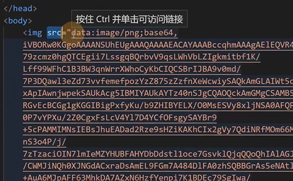

这张图片的src路径很长，有图片所显示的5倍
这个src路径不是绝对路径，更不是相对路径，而是data url。
这种方法用的其实很少，就像下图css文件，其实开发时绝大多数情况下不会这么写
## 如何书写data url

### 数据链接
表示直接将目标文件的数据写到路径位置
凡是可以使用url的地方都可以使用data url

### 语法
data:MIME,数据
翻译过来就是先写data，然后是英文的:，然后是MIME类型，然后是英文,，然后是数据
上图是一张图片的数据，其实不止是图片，包括css，js都可以用这种类型
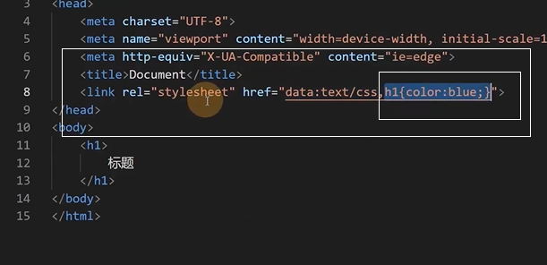

### 意义
为什么要用data url
- 优点：

1. 减少了浏览器中的请求，图二减少了请求中浪费的时间
> 请求：从自己的电脑中向淘宝的服务器发送一个消息，要求它返回需要的技术代码，实现我们需要的页面
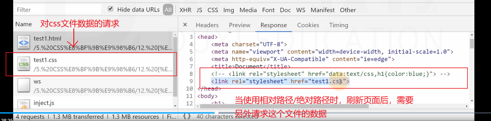
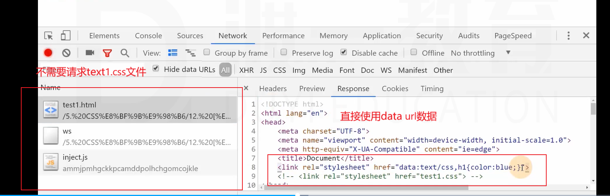
2. 有利于动态生成数据
数据在文件中就写死了。使用这种方法的话有利于js或其他语言动态生成。之前做demo的时候，js就不能控制css文件中的数据。只能用行内样式。
> 响应：淘宝的服务器把用户请求的数据给了用户

- 缺点：
1. 增加了页面的数据内容（增加了资源的体积），导致了传输内容增加，从而增加了单个资源的传输时间。
之前成哥的课程中，html页面和css文件是两条线，异步加载，同时进行。
2. 不利于浏览器的缓存
浏览器通常会缓存图片文件，css文件，js文件，每次打开同一个html页面时，不需要从新请求。
注意，如果把数据直接写到页面里，每次打开同一个html页面时，需要从新请求。
3. 会增肌原资源的体积到原来的4/3
假设文件的体积是3kb，转换完以后就成了4kb。
不会降低体积，反而会增加体积。
### 应用场景

1. 请求单个图片体积较小，并且该图片因为各种原因，不适合制作雪碧图。

2. 图片由其他代码动态生成，并且图片较少，可以使用数据链接


## base64
这是一种编码方式

通常用于将一些二进制数据（图片的数据就是二进制）用一个可书写的字符串表示

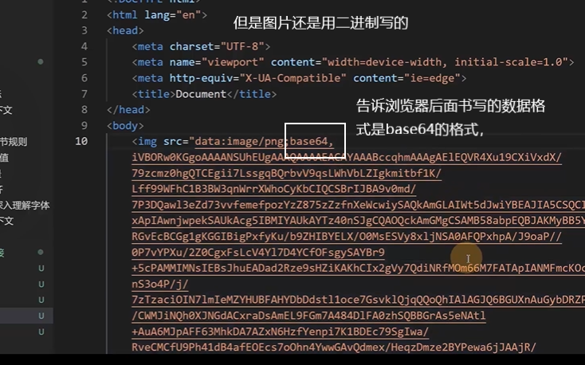

除了二进制之外，其他的数据也能变成base64的格式
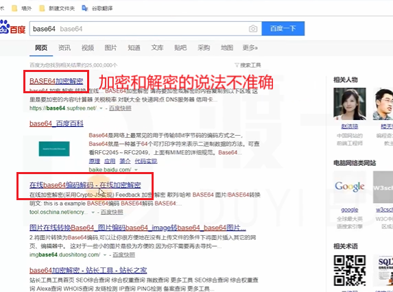
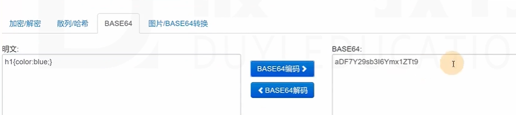
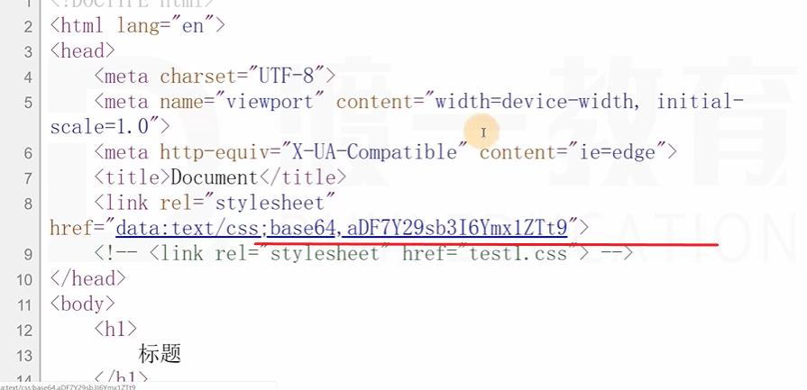
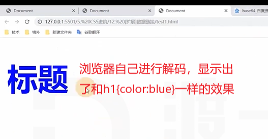

图片的数据也可以用这种方法转换，这里就不放图了，打开网页自己就会了。

# 浏览器的兼容性问题
## 问题产生原因
- 市场竞争
- 标准版本的变化

## 厂商前缀

> 比如 box-sizing:
>>谷歌旧版本浏览器中使用这种书写方式：-webit-box-sizing

- 市场竞争，标准还没有发布，自己新发布属性，提供新功能
- 标准仍在讨论中（草案），但是浏览器厂商希望先支持这个属性。

### 主流浏览器的厂商前缀
IE: -ms-
Chrome,safari: -webkit-
opera: -o-
firefox: -moz-

为了兼容低版本的浏览器大家可以把厂商前缀加上

### 厂商前缀应用
```html
<!-- 在页面中加入一个div -->
<body>
    <div>
    </div>
</body>
<!-- div的样式写到下面 -->

<style>
    div{
        border:2px solid;
        width:200px;
        height:200px;
        padding:50px;
        box-sizing: border-box;
        /* 全部写上，以适应不同版本的浏览器 */
        -ms-box-sizing:border-box;
        -webkit-box-sizing:border-box;
        -o-box-sizing:border-box;
        -moz-box-sizing:border-box;
        
    }
</style>
```
> 浏览器在处理样式或元素时，使用如下的方式：
>> 当遇到无法识别的代码时，直接略过。

关于一个插件，autoprefixer，已经下载好了，
这样使用:F1,输入auto，应该会自动选择autoprefixer，然后按回车，运行就可以了。


### 特别样式
1. 谷歌浏览器的滚动条样式
实际上，在开发中使用自定义的滚动条，往往是使用div+css+js实现的。

2. 多个背景图中选一个作为背景

在豆瓣首页有使用

这部分也没有内容，用到的时候再来回顾吧。主要是笔记不知道怎么记

## css hack

解决兼容性的手段，根据不同的浏览器（主要针对IE），设置不同的样式和元素
这里主要指针对IE的特殊前缀
1. 样式
- *属性，兼容IE5、IE6、IE7
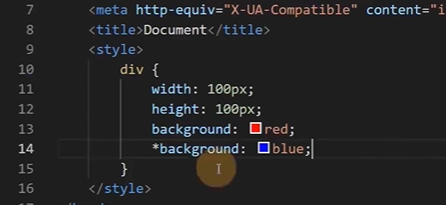

- _属性，兼容IE5~IE6

- 属性值\9，兼容IE5到IE10

- 属性值\0，兼容IE8~IE10

- 属性值\9\0，兼容IE9、IE10

- IE5、IE6、IE7的外边距bug，浮动元素的左外边距翻倍

2. 条件判断
还是没写，听课吧。
因为老师说用不到...

## 渐进增强 和 优雅降级
两种解决兼容性问题的思路，会影响代码的书写风格
- 渐进增强：先适应大部分浏览器，然后针对新版本浏览器加入新的样式。
书写代码时，先尽量避免书写有兼容性问题的代码，完成之后，再逐步加入新标准中的代码。

- 优雅降级：先制作完整功能，然后针对低版本浏览器进行特殊处理

书写代码时，先不用特别在意兼容性，完成整个功能之后，再针对低版本浏览器处理样式。

## caniuse
查找css兼容性
https://caniuse.com/


# 居中总结
居中，盒子在其包含块中居中
## 行盒（行块盒居中）
直接设置行块盒的父元素：text-align:center;

## 常规流块盒水平居中
定宽，margin值左右auto

## 绝对定位元素的水平居中

定宽，设置左右坐标为0（left：0，right：0），将左右margin设置为auto。

> 实际上，固定定位（fixed）是绝对定位（absolute）的特殊情况

##　单行文本垂直居中
height=line-height

## 行块盒和块盒内内多行文本的垂直居中
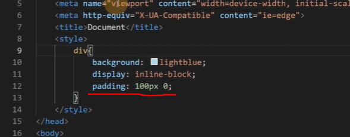
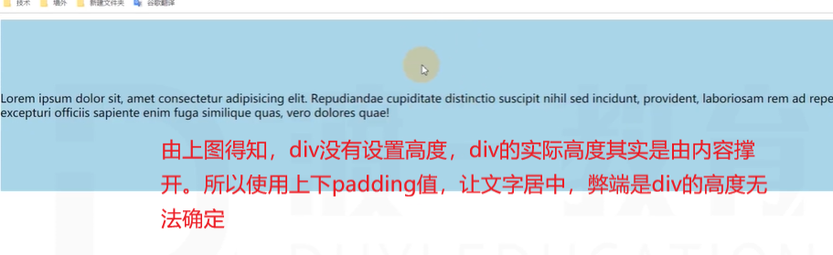

没有完美方案，通过这种方式达到类似于垂直居中的效果。

## 绝对定位的垂直居中

定高，设置左右坐标为0（top：0，bottom：0），将上下margin设置为auto。

## 水平垂直居中
定宽，定高。
left：50%
top：50%
margin-left
margin-top
负的二分之一宽高

或者

left：0
top：0
bottom：0
right：0
margin：auto auto
这是得试试，自己试验一下

# 样式补充
## display:list-item
设置为该属性的盒子，本质上仍然是一个块盒，但同时该盒子会附带另一个盒子

元素本身生成的盒子叫做主盒子，附带的盒子称为次盒子，次盒子和主盒子水平排列

比如ul中的li元素前面的小圆点，li的display:list-item;

涉及的css属性:
> 以下这些内容在MDN搜索就一目了然了
所以下面内容不是很全面，请自行搜索
1. list-style-type
2. list-style-position

## 图片失效时的宽高问题
如果img元素的图片链接无效，img元素的特性和普通行盒一样，无法设置宽高

## 行盒中包含行块盒或可替换元素

行盒的高度与它内部的行块盒或可替换元素的高度无关。
把行盒改成行块盒或者块盒。
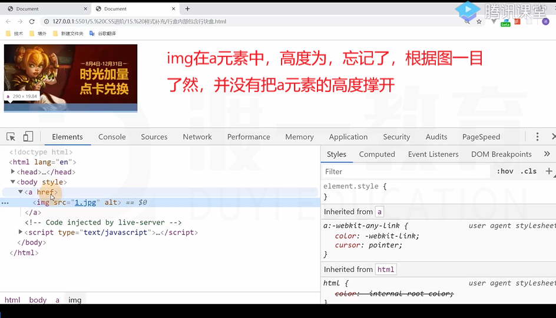

行盒的高度和字体大小有关，上图中的例子，把a元素的font-size设置为0，a元素的高度就为0。但是图片还在，不妨碍图片点击。自己敲敲试验一下。其实不用试验，在解决图片白边问题的时候，解决方法中的其中之一就是父元素的font-size设置为0。

## text-align:justify

默认值：start

其他的取值这里就不写了，自行MDN

justify：多行文本分散对齐，最后一行除外

## 制作一个三角形
和成哥的处理方法一样

## direction 和 writing-mode

开始 start -> end 结束
左 left -> right 右

开始和结束是相对的，不同国家有不同的习惯
左右是绝对的，direction设置的是开始到结束的方向

去国外工作的时候才能遇到，到时候可以详细了解，老师也只讲了一点点

writing-mode：设置文字的书写方向
写古文的时候比较有用。万一要竖排排列呢。

## utf-8字符

可以看完字体图标，再把这部分内容看看，最后十分钟内容。


